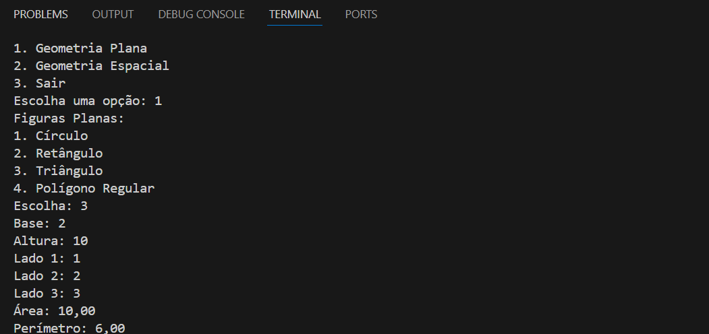

🧮 Calculadora de Geometria Plana e Espacial

Este projeto é uma aplicação simples em Java que implementa uma calculadora de figuras geométricas planas e espaciais.
Através de um menu interativo no terminal, o usuário pode escolher diferentes figuras e sólidos para calcular área, perímetro, volume e área superficial.

🚀 Funcionalidades
🔹 Geometria Plana

Círculo, Retângulo, Triângulo e Polígono Regular → área e perímetro

🔹 Geometria Espacial

Cubo, Esfera, Cilindro e Prisma Retangular → volume e área superficial

🛠️ Tecnologias Utilizadas

Java 17+

Programação orientada a objetos

Métodos estáticos para cálculos

Estrutura modular:

Principal.java → menu interativo

Geoplana.java → figuras planas

Geoespacial.java → sólidos espaciais

